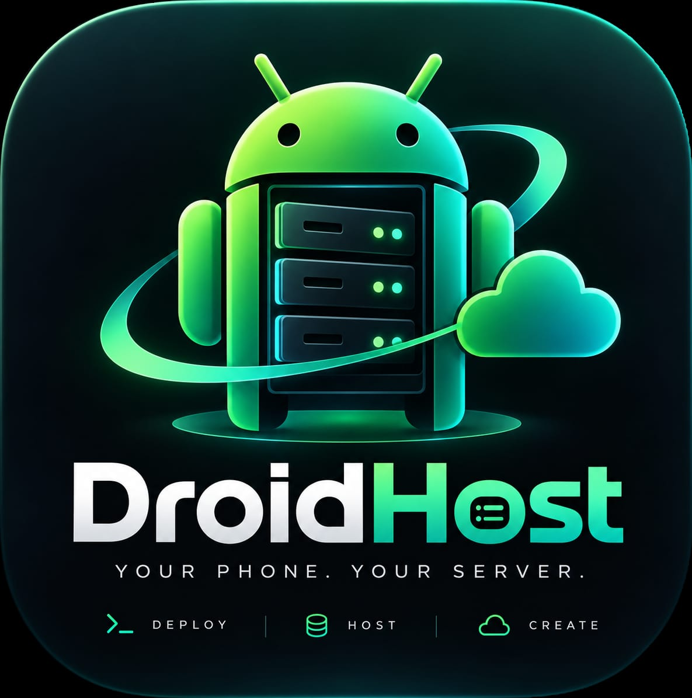
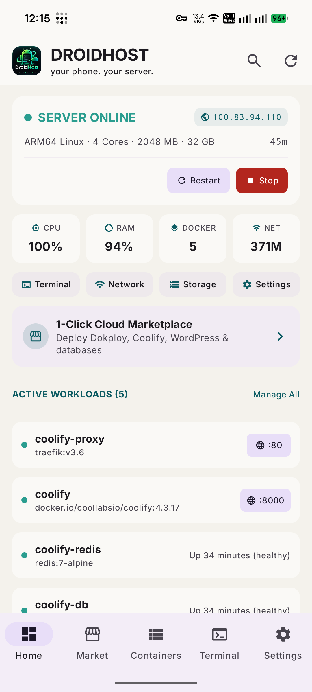
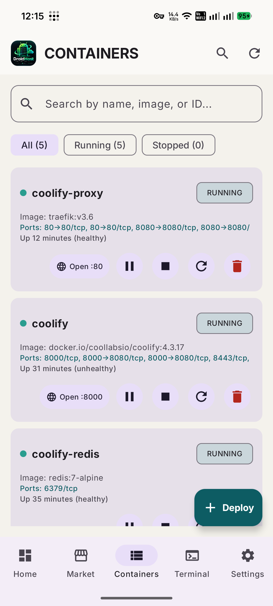
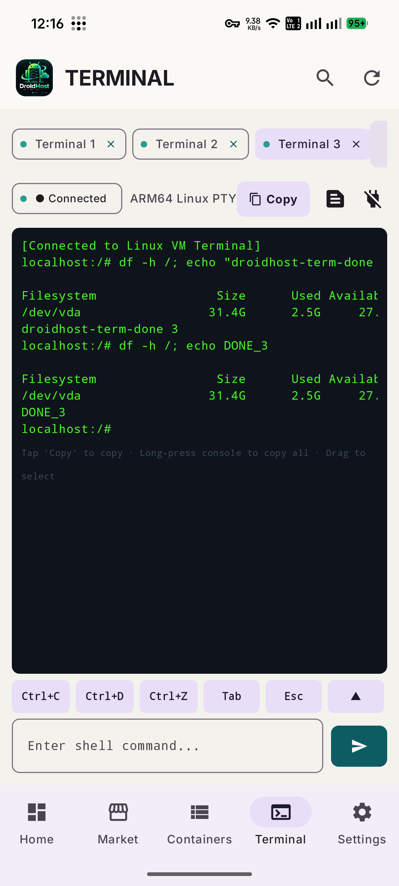
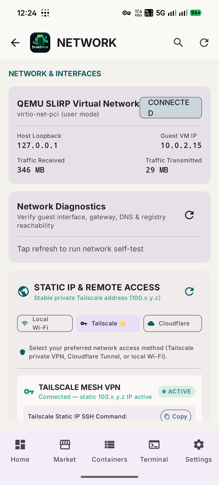

<div align="center">



# DROIDHOST

### Turn your Android phone into a sovereign ARM64 Linux server.

**A native virtualized Linux machine, full Docker Engine, multi-session PTY terminal, and self-hosted cloud platform running directly on Android.**

<p align="center">
  
  
  
  
  
  
</p>

<p align="center">
  <code>100% Native Linux VM</code> &nbsp;·&nbsp; <code>Real Docker Daemon</code> &nbsp;·&nbsp; <code>Zero PRoot Hacks</code> &nbsp;·&nbsp; <code>Multi-PTY Terminal</code> &nbsp;·&nbsp; <code>SSH on Port 2222</code>
</p>

</div>

---

## ✦ The Sovereign Hardware Philosophy

<div align="center">

### 📱 Your phone is an 8-core, 35W battery-backed mini-server.

**Why rent cloud VMs when your pocket computer has 8 CPU cores, fast UFS storage, Wi-Fi 6, 5G, and a built-in UPS battery?**

DroidHost is built on a single uncompromising rule: **no fake shells, no PRoot chroot translation layer, no mocked container responses.**

</div>

<br>

### ⚡ 01 · Real Virtualization, Zero Compromises
DroidHost boots a full **AArch64 QEMU hypervisor** running a genuine **Alpine Linux ARM64 kernel (`Image`)** with virtual I/O (`virtio-net-pci`, `virtio-blk-pci`, `virtio-serial`). It is an actual Linux machine inside Android application space.

### 🐳 02 · Full Docker Engine
Inside the VM, a native Docker daemon (`dockerd`) runs directly against Linux cgroups and overlayfs storage. Run any standard ARM64 container from Docker Hub, GitHub Container Registry, or private registries without emulation overhead.

### 💻 03 · True Multi-Session PTY Terminal
Open multiple independent terminal tabs (`Terminal 1`, `Terminal 2`, `Terminal 3`). Every tab connects via WebSocket to its own dedicated Linux pseudo-terminal (`openpty`), backed by a 64KB history ring buffer for seamless reconnection.

### 🌐 04 · Native Networking & Remote Access
QEMU user-mode SLIRP networking isolates VM subnets from physical Android network topology while keeping internet connectivity completely resilient across Wi-Fi, 4G/5G mobile data, and VPN network transitions.

---

## ✦ Interface & Experience Showcase

<div align="center">

| | |
| :---: | :---: |
|  |  |
| **Live Server Dashboard**<br><sub>Real-time CPU, RAM, and network metrics · Online status indicator · 1-click workload management · Live Coolify containers</sub> | **Docker Container Management**<br><sub>Container inspect sheets · Port mappings · Live CPU/RAM stats · Start, stop, restart, delete, and inspect</sub> |
|  |  |
| **Independent Multi-PTY Terminal**<br><sub>Multiple concurrent tabs with dedicated PTYs · ANSI color support · Quick accessory buttons · Reconnect buffer</sub> | **Resilient Network & Diagnostics**<br><sub>SLIRP bridge · Automatic Android DNS discovery · DoH fallback resolver · Tailscale & Cloudflare tunnels</sub> |

</div>

---

## ✦ System Architecture

```text
+-------------------------------------------------------------------------+
|                          ANDROID PHONE (HOST)                           |
|                                                                         |
|   +-----------------------------------------------------------------+   |
|   |         Jetpack Compose Material 3 Control Panel                |   |
|   |  - Server Dashboard: CPU, RAM, Storage, Uptime, Live Metrics    |   |
|   |  - Multi-PTY Terminal: Multiple independent concurrent sessions |   |
|   |  - Docker Management: Containers, Images, Volumes, Networks     |   |
|   |  - Network & Remote Access: Diagnostics, Tailscale, Cloudflare  |   |
|   +-----------------------------------------------------------------+   |
|                                  │                                      |
|                  Foreground ServerModeService (24/7 Uptime)             |
|                                  │                                      |
|            VmNetworkBackend (SlirpNetworkBackend abstraction)           |
|                                  │                                      |
|              QEMU System Emulator (qemu-system-aarch64)                 |
|               -netdev user,id=net0,hostfwd=...                          |
+----------------------------------│--------------------------------------+
         Port Forwards:            │
         127.0.0.1:8899  ──► 8899  │ (vm-agent REST API + WebSocket PTY)
         127.0.0.1:8000  ──► 8000  │ (Coolify / Web Workloads)
         127.0.0.1:2222  ──► 22    │ (Guest OpenSSH Daemon)
                                   ▼
+-------------------------------------------------------------------------+
|                        REAL ARM64 LINUX GUEST VM                        |
|                                                                         |
|   +-----------------------------------------------------------------+   |
|   |                  vm-agent (Go REST API + PTY)                   |   |
|   |  - Bearer token authenticated (0600 token file)                 |   |
|   |  - Multi-session PTY pool with ring buffers & session reaper    |   |
|   |  - Real Network Diagnostics: DNS, Gateway, HTTPS, Docker pull   |   |
|   +-----------------------------------------------------------------+   |
|                                  │                                      |
|                             Linux Kernel (ARM64)                        |
|                                  │                                      |
|                        Docker Engine (dockerd)                          |
|                                  │                                      |
|   +──────────────────────────────┴──────────────────────────────────+   |
|   |                        User Workloads                           |   |
|   |  - Coolify v4.3+ (traefik, postgres, redis, realtime)          |   |
|   |  - Dokploy / Nginx / Databases / Custom Compose stacks          |   |
|   |  - In-guest OpenSSH server (sshd on :22)                       |   |
|   +-----------------------------------------------------------------+   |
+-------------------------------------------------------------------------+
```

---

## ✦ Core Systems & Engineering

### 1. Pluggable Network Abstraction
* **No hardcoded network topologies**: Powered by clean data classes (`PortForward`, `DnsConfig`, `VmNetworkConfig`, `NetworkDiagnostics`).
* **SLIRP Virtual Network**:
  * Guest IP: `10.0.2.15`
  * Gateway: `10.0.2.2`
  * Virtual DNS: `10.0.2.3`
* **Port Forwarding Engine**: Seamlessly maps Android loopback ports to guest ports:
  * `127.0.0.1:8899 -> 8899` (vm-agent control plane)
  * `127.0.0.1:8000 -> 8000` (Coolify web console)
  * `127.0.0.1:2222 -> 22` (Guest OpenSSH server)

### 2. Android Active Network & DNS Discovery
* Uses Android `ConnectivityManager -> activeNetwork -> LinkProperties -> dnsServers` to discover physical upstream resolvers without leaking RFC1918 LAN gateways (such as `192.168.1.1`) into the guest.
* The guest always resolves through virtual DNS `10.0.2.3:53`.

### 3. Dual-Layer DNS with DoH Fallback
* Primary resolver: Virtual SLIRP DNS `10.0.2.3:53`.
* Secondary fallback: In-VM DNS-over-HTTPS (`127.0.0.1:53`) querying Cloudflare / Google DoH over TLS.
* If physical carrier/Wi-Fi DNS is intercepted or down, queries automatically resolve over encrypted HTTPS.

### 4. Real Network Diagnostics & Self-Test
The agent provides `GET /v1/network/diagnostics` executing 8 real hardware and transport checks:
1. `interfaceUp`: Verifies `eth0` is up with a valid IPv4 address.
2. `defaultRoute`: Confirms route via `10.0.2.2` in `/proc/net/route`.
3. `gatewayReachable`: Tests route reachability to `10.0.2.2`.
4. `dnsReachable`: Tests UDP socket to `10.0.2.3:53`.
5. `dnsResolution`: Resolves public domains (`cloudflare.com`) through resolvers.
6. `httpsReachable`: Measures real HTTP/TLS handshake latency to `1.1.1.1`.
7. `dockerRegistryReachable`: Verifies TLS connection to `registry-1.docker.io/v2/`.
8. `dockerPullTest`: Performs an actual container operation with Docker Engine.

### 5. Multi-Session PTY Terminal Architecture
* **Independent PTYs**: Each terminal tab owns a distinct `/dev/pts/X` session managed by Go's `creack/pty`.
* **Zero Session Leakage**: Accidental tab switching or screen navigation preserves the PTY session and its 64KB scrollback buffer. Explicit tab closure terminates the child process and cleans up resources.
* **Idle Process Reaper**: Background worker reaps disconnected sessions after an idle timeout to prevent memory and file descriptor leaks.

### 6. Remote Access & SSH
* **Local SSH Access**:
  ```bash
  adb forward tcp:2222 tcp:2222
  ssh root@127.0.0.1 -p 2222
  ```
* **Tailscale Mesh VPN**: Static `100.x.y.z` address and MagicDNS hostname for direct remote access across CGNAT and cellular networks.
* **Cloudflare Tunnels**: Encrypted reverse tunnel mapping container ports to public custom domains (`https://your-server.domain.com`).

---

## ✦ Known Issues & Hardware Constraints

While DroidHost is fully functional on physical Android devices, contributors and users should be aware of the following technical constraints:

### 1. Physical Device Memory Limits (4GB RAM Devices)
* On entry-level Android devices with 4GB RAM (e.g. Samsung Galaxy A05), running the Android OS, QEMU VM (allocated 2GB), Docker daemon, and heavy multi-container stacks (like Coolify's 5 containers) can lead to aggressive memory pressure.
* **Workaround**: Adjust VM allocation in DroidHost **Settings** to 1536MB or 2048MB, and enable Android virtual RAM (RAM Plus/zram) if available. For production workloads, an 8GB+ RAM Android device is recommended.

### 2. Ktor OkHttp Timeout on Docker Pulls
* In earlier builds, Ktor's default OkHttp read timeout was 10 seconds. When running `Network Diagnostics` on cellular networks, downloading or verifying Docker layers through QEMU could exceed 10s, triggering a `SocketTimeoutException`.
* **Status**: Fixed in `AgentRepository.kt` by configuring OkHttp `readTimeout` to 60 seconds.

### 3. OpenSSH StrictModes & Directory Ownership
* Alpine Linux OpenSSH enables `StrictModes yes` by default. If `/root` or `/root/.ssh` is owned by an unprivileged UID from rootfs extraction, SSH key authentication will be rejected with `Permission denied (publickey)`.
* **Status**: Automated via `/etc/local.d/vm-token.start` and `build-arm64-guest.sh` by ensuring `chown -R root:root /root && chmod 700 /root`.

### 4. ICMP Ping Under QEMU User SLIRP
* QEMU user-mode SLIRP operates entirely in unprivileged userspace without `CAP_NET_RAW`. Standard ICMP ping packets cannot always be crafted without host root privileges.
* **Status**: Diagnostics endpoint handles gateway and DNS reachability via route validation and UDP socket probes to ensure deterministic reports.

### 5. musl libc & Bash Compatibility
* Alpine Linux uses `musl` libc and Busybox `sh` by default. Setting `ENV=/etc/bash/bashrc` on Busybox `sh` triggers runtime parse warnings (`sh: lib: unknown operand`).
* **Status**: Resolved. Environment variables are tailored specifically to the active shell binary (`bash` vs `sh`), and `/dev/fd -> /proc/self/fd` is symlinked idempotently.

---

## ✦ Building from Source

### Prerequisites
* **Android Development**: Android Studio Jellyfish+, JDK 17, Android SDK Platform 35.
* **Go Toolchain**: Go 1.22+ (for compiling `vm-agent`).
* **Connected Device**: ARM64 Android device with USB debugging enabled.

### 1. Compile and Test vm-agent
```bash
cd vm-agent
go test ./...
CGO_ENABLED=0 GOOS=linux GOARCH=arm64 go build -ldflags="-s -w" -o ../app/src/main/jniLibs/arm64-v8a/libvmagent.so .
cd ..
```

### 2. Run Android Unit Tests
```bash
./gradlew testDebugUnitTest
```

### 3. Build & Install Debug APK
```bash
./gradlew assembleDebug
adb install -r app/build/outputs/apk/debug/app-debug.apk
adb shell am start -n com.droidhost/.MainActivity
```

---

## ✦ Testing & Physical Acceptance Checklist

| Component | Test Procedure | Status |
| :--- | :--- | :---: |
| **QEMU AArch64 Boot** | Boots Alpine Linux ARM64 kernel inside app directory | ✅ Verified |
| **Docker Engine** | `docker info`, `docker run --rm busybox echo ok` | ✅ Verified |
| **Multi-PTY Terminal** | Concurrent sessions running `sleep 60`, `docker ps`, `df -h` | ✅ Verified |
| **Network Diagnostics** | `GET /v1/network/diagnostics` returns 8 passing checks | ✅ Verified |
| **DoH Fallback** | Drops primary DNS, resolves via 127.0.0.1:53 HTTPS | ✅ Verified |
| **Local SSH** | `adb forward tcp:2222 tcp:2222` -> `ssh root@127.0.0.1 -p 2222` | ✅ Verified |
| **Coolify Integration** | Coolify v4.3+ healthy with 5 active workloads on port 8000 | ✅ Verified |
| **Dynamic Storage** | Automatic filesystem expansion via `resize2fs /dev/vda` | ✅ Verified |

---

## ✦ Security & Token Protection

* **App-Private Security Boundary**: All VM storage, tokens, and keys reside in `/data/user/0/com.droidhost/files/vm/` with `0700` permissions.
* **Zero Secret Leakage**: The agent authentication token is never passed via kernel commandline parameters (visible in `/proc/cmdline`). It is provisioned directly to `/etc/droidhost/agent-token` with `0600 root:root` permissions.
* **Bound Interfaces**: Guest services listen strictly within guest namespaces; public access is mediated explicitly through Tailscale ACLs or authenticated Cloudflare Tunnels.

---

## ✦ License & Contribution

DroidHost is licensed under the **Apache License 2.0**. Contributions, bug fixes, and hardware test reports across diverse ARM64 Android chipsets are welcome!

<div align="center">
  <sub>Engineered for sovereign compute. Built for developers who believe their phone can be more than a client.</sub>
</div>
